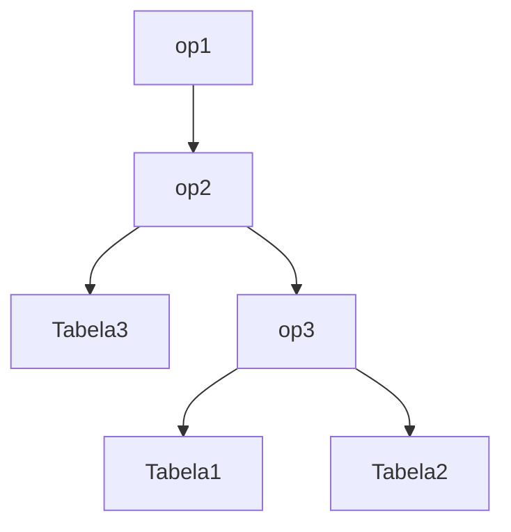
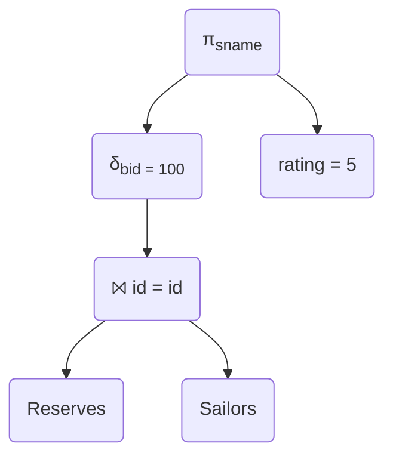
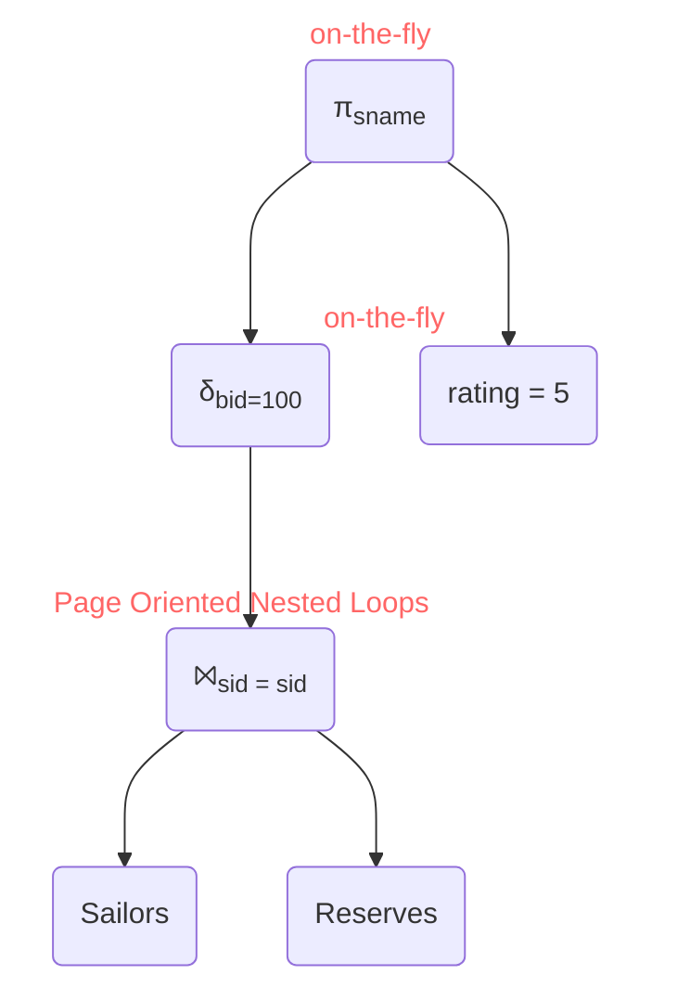
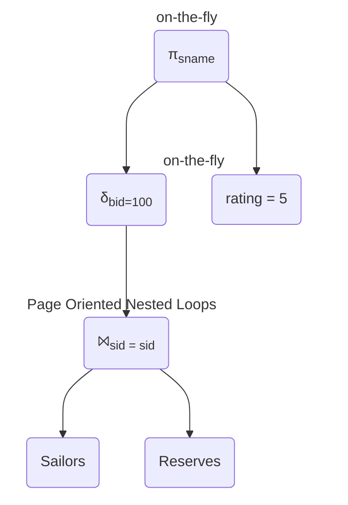
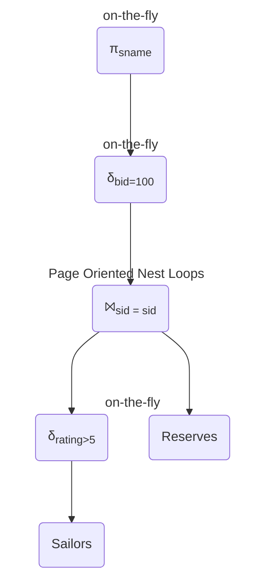

# Planos de Consulta

    // Carregar shipment do banco
    // ao invés de criar um novo, fazer um findquery
    // fazer o novo q o padrão é correct
    // atualizar os testes

## Otimizador de consulta

Problema: Uma query SQL é declarativa - não especifica o plano de execução.  
Solução: Converter a query para um plano equivalente da álgebra relacional.

## Esquema Geral do Otimizador

- Estratégia que o banco utiliza para executar uma consulta
- Normalmente, vários planos são proposto e um deles é escolhido
- O plano é um pseudocódigo em forma de árvore e álgebra relacional



• A consulta é convertida em álgebra relacional
• Álgebra relacional é convertida em uma árvore
• Cada operador pode ser alterado
• Operadores podem ser aplicados em diferentes ordens

```sql
SELECT S.sname
FROM Reserves R, Sailors S
WHERE R.id = S.id
AND R.id = 100
AND S.rating > 5
```



## Estratégias para processar consulta

- Qual tabela processar primeiro
  - Mais ou menos volumosa
- Utilizar índice
- Ordenar tabela
- Tratamento junção
- Melhor decomposição
- Quantos planos propor
- Como escolher o melhor plano
- Algoritmo de tratamento dos operadores

## Esquema de exemplo

Sailors (id: integer, sname: string, rating: integer, age: real)
Reserves (id: integer, bid: integer, day: dates, rname: string)

**Reserves:**

- Cada tupla com 40 bytes, 100 tuplas por página , 1000 páginas.
- Assumir que existe 100 barcos diferentes, **distribuídos uniformemente;**

**Sailors:**

- Cada tupla com 50 bytes, 80 tuplas por página, 500 páginas;
- Assumir que existem 10 diferentes ratings, **distribuídos uniformemente;**
- Assumir que temos 5 páginas no buffer

```sql
SELECT S.sname
FROM Reserves R, Sailors S
WHERE R.id=S.id AND
 R.id=100 AND S.rating>5
```

- Custo

Plan:
π δ ⨝



# Planos alternativos



=> 500.500 IOs

pi("π<sub>sname</sub>") --> rating("rating = 5")

    delta("δ<sub>bid=100</sub>") --> join("⨝<sub>sid = sid</sub>")
    join("⨝<sub>sid = sid</sub>") --> s(Sailors)
    join("⨝<sub>sid = sid</sub>") --> reserves(Reserves)


250.500 IOs
# Explain Analyze

The `EXPLAIN ANALYZE` command in PostgreSQL is a powerful tool used to understand and optimize the execution plan of a query. It provides detailed information about how PostgreSQL intends to execute a query and how it actually performs during execution.

Here's a breakdown of how to interpret the output of `EXPLAIN ANALYZE`:

1. **Query Plan Structure:**
   - The output shows a tree-like structure representing the steps PostgreSQL takes to execute the query. Each step is called a "Node" and is represented by a keyword such as `Seq Scan`, `Index Scan`, `Nested Loop`, `Hash Join`, etc.

2. **Operation Type:**
   - Each node in the query plan performs a specific operation to retrieve, filter, or join data. For instance:
     - `Seq Scan`: Sequentially scans a table.
     - `Index Scan`: Uses an index to retrieve rows.
     - `Nested Loop`: Performs nested loop joins between tables.
     - `Hash Join`: Performs hash joins between tables.

3. **Costs and Statistics:**
   - PostgreSQL estimates the cost of each operation based on various factors like disk I/O, CPU usage, etc. These estimated costs are displayed alongside the actual execution times.
   - Important columns include `cost`, `rows`, `actual time`, `loops`, `actual rows`, and more, depending on the query plan node.

4. **Execution Time:**
   - The `actual time` column shows the actual time taken by PostgreSQL to execute a specific node during query execution.

5. **Filtering and Joining Conditions:**
   - Conditions used for filtering rows (`Filter` node) or joining tables (`Join` nodes) are shown, aiding in understanding how PostgreSQL applies WHERE clauses, JOIN conditions, etc.

6. **Order of Execution:**
   - The plan depicts the order in which PostgreSQL executes different parts of the query. It usually starts from the innermost nodes and works its way outwards.

7. **Index Usage and Scan Methods:**
   - Information about the usage of indexes, scan methods (sequential, bitmap, etc.), and access methods is included in the output.

8. **Actual vs. Estimated Rows:**
   - PostgreSQL provides estimates for the number of rows it expects at each step (`rows` column). The `actual rows` column shows the actual number of rows processed during execution. Significant discrepancies between estimated and actual rows could indicate a need for query optimization.

When interpreting the output of `EXPLAIN ANALYZE`, look for inefficiencies, such as sequential scans when an index scan could be more efficient, high costs, unexpected join methods, or significant differences between estimated and actual rows. This information helps in optimizing queries by adding/changing indexes, rewriting queries, or restructuring tables.

Understanding `EXPLAIN ANALYZE` output is crucial for optimizing query performance in PostgreSQL databases. Experiment with different query structures, indexes, and table designs to improve performance based on the insights provided by this command.